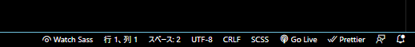

# Procon32 Lets AIdea

## 開発環境

## GitHub を使う上でのルール

- 作業の手順

1.  Issue を立てる
1.  branch を作る
    1. branch 名は `GitHubのユーザー名/issue_issue番号`
1.  作業する(add, commit, push)
1.  Pull request を立てる
1.  レビューで指摘されたら 3. に戻る
1.  レビューが終わり、 Approve をした人が Merge まで行う

- ファイル管理
  - 基本的に英語小文字でハイフン区切り(ケバブケース)統一
  - モードやファイル形式ごとにフォルダを作る
    - 例
      - 学習モード用: `learn` フォルダ
      - CSS ファイル用: `css` フォルダ
  - ファイル名は読むだけで何の役割かわかるように
    - 例
      - クイズページ: `quiz.html`
      - 回答ページ: `answer.html`

## Scss(Sass) から CSS への変換方法

1. VSCode の拡張機能に、「[Live Sass Compiler](https://marketplace.visualstudio.com/items?itemName=ritwickdey.live-sass)」 をインストール
1. VSCode 画面下のバーにある 「Watch Sass」 をクリック (※VSCode を再起動するたびにクリックする必要があります)

   

1. Scss(Sass)ファイルを保存するたびに、CSS ファイルが出力される
